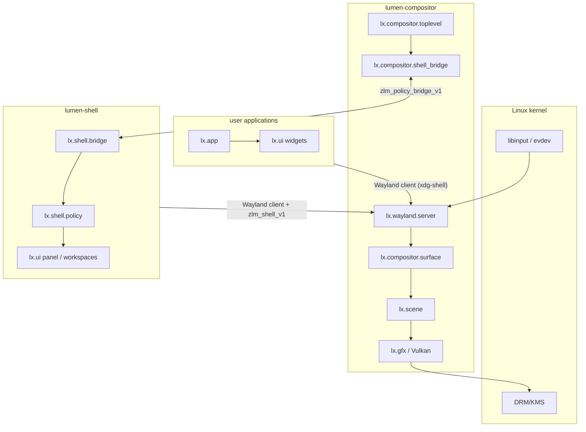
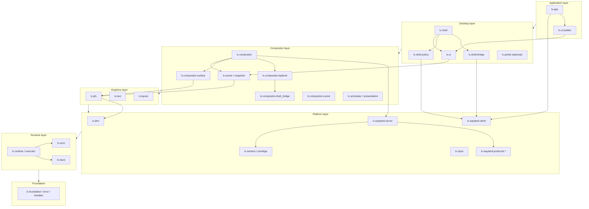
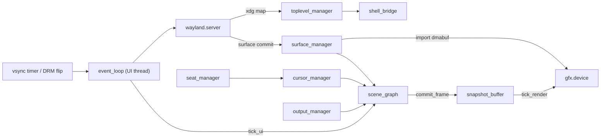
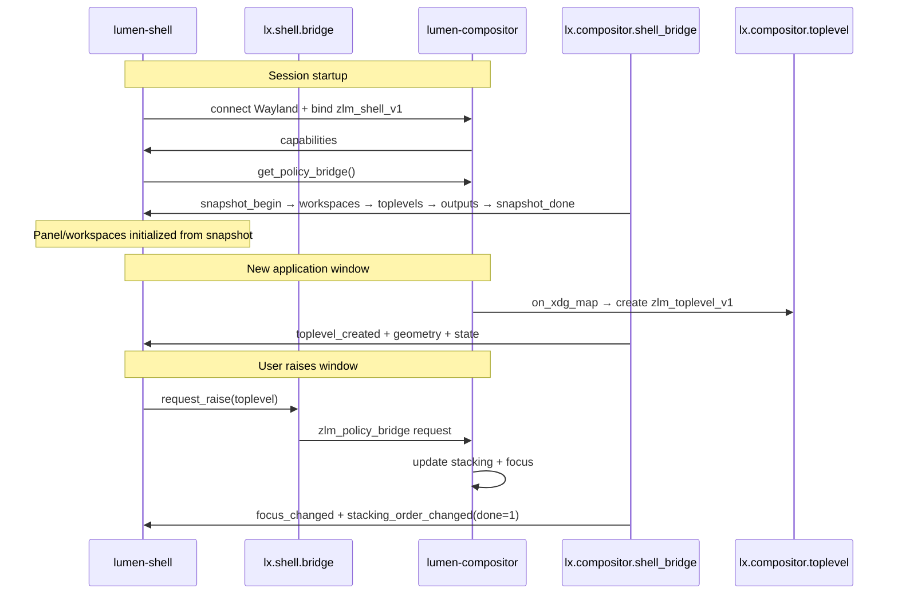
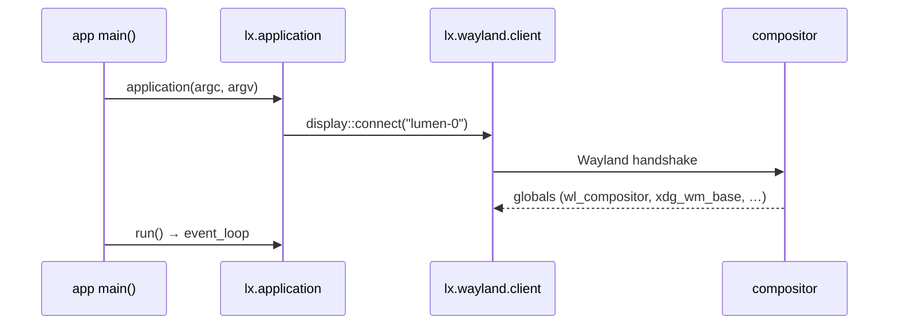
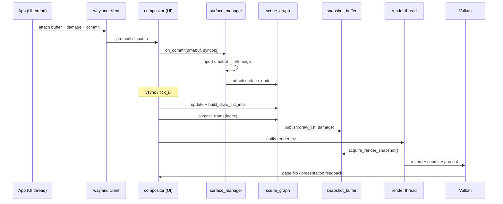
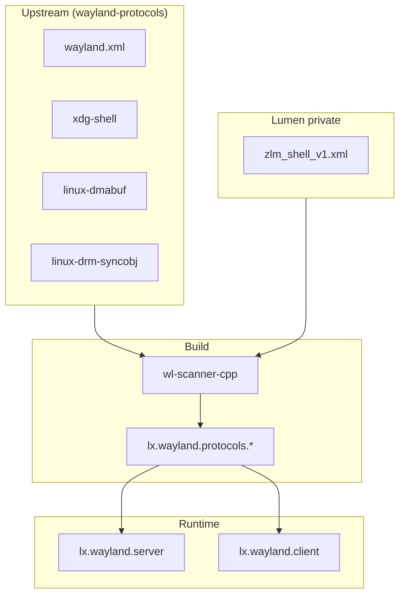
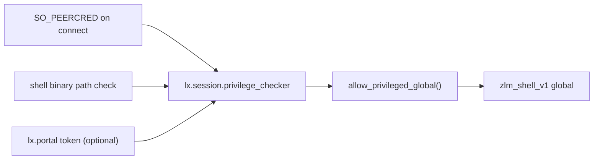
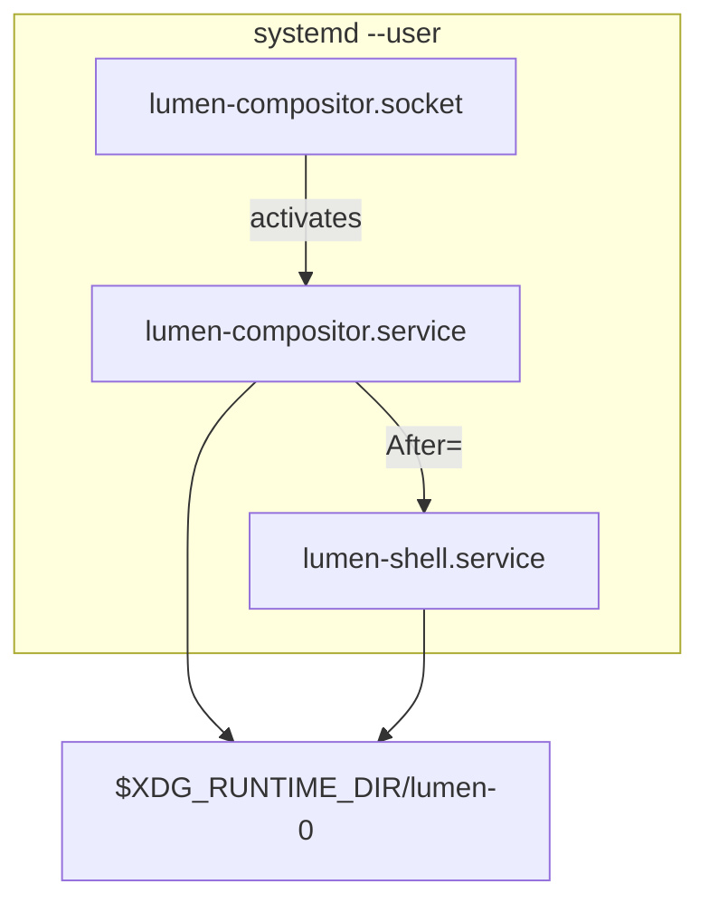

> **Status:** Current (v0.3) — see code for implementation truth

# Lumen Architecture

Detailed overview of the Lumen windowing stack: module layers, process boundaries,
interaction patterns, and runtime workflows.

**Related docs:** [API reference](api/README.md) · [UML diagrams](uml/README.md) ·
[Threading](subsystems/threading.md) · [Rendering performance](subsystems/rendering-performance.md) ·
[Errors & logging](subsystems/errors-and-logging.md) ·
[Shell state sync](subsystems/shell-state-sync.md) · [dmabuf/Vulkan](subsystems/dmabuf-vulkan-import.md) ·
[Memory](subsystems/memory-management.md) · [Health](subsystems/health.md) ·
[UI architecture](subsystems/ui-architecture.md) ·
[AI agent instructions](../AGENTS.md)

---

## 1. What Lumen is

Lumen is a greenfield Linux desktop stack built in **C++26** with **Clang**:

| Component | Role |
|-----------|------|
| **Compositor** (`lumen-compositor`) | Wayland display server, input routing, surface composition, Vulkan present |
| **Shell** (`lumen-shell`) | Desktop chrome — panel, workspaces, window management UI |
| **UI library** (`lx.ui`, `lx.ui.builder`) | Widget toolkit + fluent builders for apps and shell |
| **App framework** (`lx.app`) | Event loop, settings, clipboard for third-party apps |

Design goals:

- **Wayland-only** — no X11 layer
- **Vulkan-first** — discrete + integrated GPU paths
- **Multi-process** — compositor owns display; shell and apps are clients
- **Stacking-first WM** — optional tiling plugin via `lx.shell.policy`
- **First-class threading** — UI / render / worker affinities with immutable frame handoff
- **Zero-copy where possible** — dmabuf → Vulkan import, explicit sync via drm-syncobj
- **Performance pipeline** — snapshot v2, direct scanout, import cache, hot-path budgets ([rendering-performance.md](subsystems/rendering-performance.md))
- **Memory strategy** — unified arenas, pressure response, buffer lifecycle ([memory-management.md](subsystems/memory-management.md))
- **Health evaluation** — parts, processes, memory, speed → `health_report` ([health.md](subsystems/health.md))

---

## 2. Process model

Three classes of OS processes cooperate over Wayland:



### 2.1 Compositor process

**Binary:** `lumen-compositor`  
**Modules:** `lx.compositor`, `lx.compositor.*`, `lx.wayland.server`, `lx.scene`, `lx.gfx`, `lx.input`, `lx.drm`, …

Owns:

- Wayland socket (`$XDG_RUNTIME_DIR/lumen-0`)
- All `wl_*` / `xdg_*` / `zwp_*` protocol objects
- **`zlm_toplevel_v1`** handles (compositor-owned WM references)
- DRM master / KMS page-flip
- Scene graph + Vulkan composition
- Input seat and focus

Runs **three logical threads** (see [threading.md](subsystems/threading.md)):

| Thread | Affinity | Work |
|--------|----------|------|
| Main | `ui` | Event loop, vsync timer, `tick_ui()`, Wayland dispatch |
| Render | `render` | `tick_render()`, snapshot acquire, Vulkan record |
| Worker | `worker` | Executor drain — layout assist, I/O |

### 2.2 Shell process

**Binary:** `lumen-shell`  
**Modules:** `lx.shell`, `lx.shell.bridge`, `lx.shell.policy`, `lx.ui`, `lx.wayland.client`

Acts as a **privileged Wayland client**:

- Connects to `lumen-0` like any client
- Binds **`zlm_shell_v1`** (not available to regular apps)
- Uses **`zlm_policy_bridge_v1`** for window-management intent ↔ compositor execution
- Renders panel, workspace switcher, decorations via `lx.ui`

The shell **does not** own surfaces of other apps or mutate the scene graph directly.
It sends policy requests; the compositor executes geometry, focus, and stacking.

### 2.3 Application processes

**Typical binary:** user app linked against `lx.app`  
**Modules:** `lx.app`, `lx.ui`, `lx.ui.builder`, `lx.wayland.client`

Each app:

- Connects to the compositor display
- Creates `xdg_toplevel` + `wl_surface` for its windows
- Uses `lx.ui` widgets; optional fluent builder API
- Submits buffers (SHM during dev, dmabuf in production)

Apps never see `zlm_shell_v1` or `zlm_toplevel_v1`.

---

## 3. Module layers

Dependency flows **downward** — higher layers never export to lower ones.
CMake encodes this graph in `cmake/LumenCXXModules.cmake` (`LUMEN_LAYER_*`) and
rejects upward `DEPENDS` at configure time.

Shared WM vocabulary (`lx::toplevel_state`, `lx::placement`) lives in
`lx.foundation` so the compositor can describe toplevel state without depending
on `lx.shell.policy`. Policy implementations stay in the desktop layer.
`lx.ui` is also desktop-layer: shell and apps both consume it; only
`lx.ui.builder` / `lx.app` sit above.




### Layer responsibilities

| Layer | Purpose | Key contracts |
|-------|---------|---------------|
| **Foundation** | Types, errors, handles, WM vocabulary | `result<T>`, `toplevel_id`, `toplevel_state`, `placement` |
| **Runtime** | Event loop, thread routing, logging | `executor`, `event_loop`, `logger` |
| **Platform** | OS / kernel / Wayland wire | `server::bind`, `kms_device::open`, protocols |
| **Graphics** | Vulkan RHI, text, layout | `dmabuf_importer`, `layout_engine`, `scene_graph` |
| **Compositor** | Display server integration | `tick_ui` / `tick_render`, `shell_bridge` |
| **Desktop** | WM policy, shell UI, shared widget toolkit | `policy_bridge`, `stacking_policy`, `lx.ui` |
| **Application** | End-user programs + fluent builders | `lx::application`, `make_window()` |

---

## 4. Compositor internal architecture

Inside `lumen-compositor`, subsystems connect as follows:



### Subsystem roles

| Module | Responsibility |
|--------|----------------|
| `lx.wayland.server` | Socket, client connections, protocol dispatch, global registry |
| `lx.compositor.toplevel` | Maps `xdg_toplevel` → `zlm_toplevel_v1` + internal `toplevel_record` |
| `lx.compositor.surface` | Commit handler: damage, dmabuf desc, syncobj timeline, `content_hint` |
| `lx.compositor.shell_bridge` | Emits snapshot/deltas on `zlm_policy_bridge_v1`; receives WM requests |
| `lx.compositor.cursor` | Pointer sprite, hotspot, scene overlay |
| `lx.compositor.output` | Per-output present mode, KMS damage flags |
| `lx.scene` | Scene graph, damage collection, `build_draw_list_into` |
| `lx.scene.snapshot` | Triple-buffered handoff (v2: index swap, back-pressure policy) |
| `lx.gfx` | Vulkan device, swapchain, dmabuf import, render pass |
| `lx.gfx.import_cache` | LRU reuse of VkImage imports; per-client entry cap |
| `lx.compositor.buffer_lifecycle` | import → release → wl_buffer.release loop |
| `lx.runtime.memory` | Per-subsystem arenas, pressure coordinator, overflow policies |
| `lx.input` + `seat_manager` | libinput → pointer/keyboard events → focus |
| `lx.drm` + `lx.drm.atomic` | Connectors, modes, atomic commit, KMS damage blobs |
| `lx.scheduler.presentation` | Page-flip bridge, wp_presentation feedback |
| `lx.scheduler.budget` | Hot-path CPU budgets per tick |

---

## 5. Shell ↔ compositor workflow

Window management is split: **shell decides intent**, **compositor enforces state**.



### Policy direction

| Direction | Mechanism | Examples |
|-----------|-----------|----------|
| Compositor → Shell | `zlm_policy_bridge_v1` events | `snapshot_*`, `toplevel_created`, `focus_changed` |
| Shell → Compositor | `zlm_policy_bridge_v1` requests | `request_activate`, `set_toplevel_stacking_index`, `request_close` |

C++ API mirrors the wire protocol:

- Server: `lx::compositor::shell_bridge`
- Client: `lx::shell::policy_bridge`

See [shell-state-sync.md](subsystems/shell-state-sync.md) for the full event list.

---

## 6. Application workflow

### 6.1 Startup



### 6.2 UI construction (declarative)

UI is described as a function of state. A build function returns arena-allocated
descriptors, the reconciler folds them onto the retained node tree, and modifiers compose
with `operator|`:

```cpp
import lx.app;
import lx.ui;

child settings_body(const settings_state& s, host& h) {
    return vflow(
        label(s.title),
        checkbox(s.dark_mode, bind(h, toggle_dark{}))
    ) | insets(12) | grow();
}
```

Internally: `window` owns or wraps a `xdg_toplevel` + `wl_surface`; retained nodes run
measure/arrange and then **emit draw commands** into the scene graph — they never
rasterize. Commits go to the compositor on the UI thread.

The `lx.ui.builder` fluent API is superseded by decorators; see
[ui-architecture.md](subsystems/ui-architecture.md) §9 for migration status.

### 6.3 Frame commit (client → screen)



Details: [threading.md](subsystems/threading.md), [dmabuf-vulkan-import.md](subsystems/dmabuf-vulkan-import.md).

---

## 7. Threading and frame handoff

Golden rule: **UI mutates, render reads immutable snapshots.**

```
┌──────────────── UI thread (affinity::ui) ─────────────────┐
│  event_loop → vsync → tick_ui()                         │
│    wayland.dispatch()                                   │
│    scene.update() → build_draw_list_into(write_slot)    │
│    scene.commit_frame() → snapshot_buffer.publish()     │
└────────────────────────────┬──────────────────────────────┘
                             │ atomic index swap
┌──────────────── Render thread (affinity::render) ───────┐
│  render_cv.wait → tick_render()                         │
│    snapshot.acquire()  // immutable                     │
│    gfx.record + submit + present                        │
└─────────────────────────────────────────────────────────┘

┌──────────────── Worker thread (affinity::worker) ───────┐
│  executor.drain(worker) — layout assist, I/O, decode    │
│  results posted back: executor.post(ui, callback)       │
└─────────────────────────────────────────────────────────┘
```

Cross-thread work routing: `lx.runtime.executor` + `lx.sync.spsc_queue`.

Presentation timing (future): `lx.scheduler.presentation` replaces timer vsync with
DRM page-flip / `wp_presentation` feedback.

---

## 8. Wayland protocol stack

Protocols are declared in `protocols/manifest.toml` and codegen'd by `wl-scanner-cpp`
into `lx.wayland.protocols.*` modules.

| Priority | Protocols | Consumer |
|----------|-----------|----------|
| **P0** | `wayland`, `xdg-shell`, `linux-dmabuf`, `linux-drm-syncobj`, `xdg-output`, output-management | Compositor boot |
| **P1** | `presentation-time`, `xdg-decoration`, … | Frame timing, decorations |
| **Private** | `zlm_shell_v1` (+ bridge, workspace, layer, rules) | Shell only |



Regular clients: **xdg-shell** only.  
Shell: **xdg-shell** + **zlm_shell_v1** (privilege-gated).

### Decision: wrap libwayland-server

**Choice:** wrap **libwayland-server** behind `lx.wayland.server` — do not rewrite the wire
protocol from scratch for P0.

**Rationale:** the Wayland wire layer is not the compositor bottleneck. Frame cost lives in
dmabuf import, scanout evaluation, Vulkan composite, and KMS present. A from-scratch
marshaller would delay P0 (“one client → one dmabuf → one frame”) without improving those
paths.

**Seam:** `lx.wayland.server` remains the only module that talks to `wl_display` /
`wl_client` (when `LUMEN_HAS_WAYLAND` is defined). Callers see typed Lumen APIs
(`bind`, `dispatch`, `add_global`, `allow_privileged_global`). A from-scratch wire layer
is deferred indefinitely unless a concrete need appears.

---

## 9. Security and privilege



Default build: Unix session permissions — same UID, known shell binary.  
Optional Flatpak build: `lx.portal` validates capability tokens before exposing
privileged globals.

Window rules (`zlm_window_rules_v1`) load from `$XDG_CONFIG_HOME/lumen/window-rules.toml`.

---

## 10. Session deployment (systemd)

Typical user session:



Unit files: `deploy/systemd/`

| Unit | Role |
|------|------|
| `lumen-compositor.socket` | Creates `$XDG_RUNTIME_DIR/lumen-0` |
| `lumen-compositor.service` | Starts compositor, holds DRM lease |
| `lumen-shell.service` | Starts after compositor; `Requires=lumen-compositor` |

---

## 11. Errors and observability

All fallible APIs return **`lx::result<T>`**. Platform stubs return
`lx::not_implemented("fully::qualified::name")` until wired.

| Concern | Module | Behavior |
|---------|--------|----------|
| Typed errors | `lx.foundation.error` | Domains, codes, `LX_RETURN_IF_ERROR` |
| Logging | `lx.trace` | stderr default, `LUMEN_LOG` env, `log_error()` |
| Spans | `LX_TRACE_SCOPE` | Frame hot-path tracing at `trace` level |

Orchestration boundaries (e.g. `compositor::start()`) log failures once via
`log_error` before returning. See [errors-and-logging.md](subsystems/errors-and-logging.md).

---

## 12. Build and codegen pipeline

```
protocols/manifest.toml
        │
        ▼
scripts/fetch-protocols.sh  →  protocols/upstream/*.xml
        │
        ▼
scripts/protocol_manifest.py  →  GeneratedProtocols.cmake
        │
        ▼
wl-scanner-cpp  →  lx.wayland.protocols.* (C++26 modules)
        │
        ▼
CMake lumen_add_module_library  →  liblx.* + executables
```

Tools: `wl-scanner-cpp` (protocol codegen), `lumen-theme` (theme compiler stub).

---

## 13. Implementation status (scaffold vs P0)

The **architecture and API contracts** are in place; most **platform bodies** are stubs
returning `not_implemented` until P0 lands.

| Area | Status |
|------|--------|
| Module graph, protocols, docs | Complete |
| Threading model + snapshot handoff | Scaffold wired in compositor |
| Wayland server bind/dispatch | P0 — stub |
| dmabuf → Vulkan import | P0 — stub |
| Shell snapshot/delta wire-up | P0 — API scaffolded |
| DRM page-flip vsync | P1 — timer stub today |

**First milestone:** one client → one dmabuf → one frame on screen.

---

## 14. Document map

| Topic | Document |
|-------|----------|
| Public API index | [api/README.md](api/README.md) |
| All UML diagrams | [uml/README.md](uml/README.md) |
| Threading | [subsystems/threading.md](subsystems/threading.md) |
| Rendering performance | [subsystems/rendering-performance.md](subsystems/rendering-performance.md) |
| Memory management | [subsystems/memory-management.md](subsystems/memory-management.md) |
| Health evaluation | [subsystems/health.md](subsystems/health.md) |
| Errors & logging | [subsystems/errors-and-logging.md](subsystems/errors-and-logging.md) |
| Shell state sync | [subsystems/shell-state-sync.md](subsystems/shell-state-sync.md) |
| dmabuf / Vulkan | [subsystems/dmabuf-vulkan-import.md](subsystems/dmabuf-vulkan-import.md) |
| UI architecture | [subsystems/ui-architecture.md](subsystems/ui-architecture.md) |
| Protocol registry | [../protocols/README.md](../protocols/README.md) |
