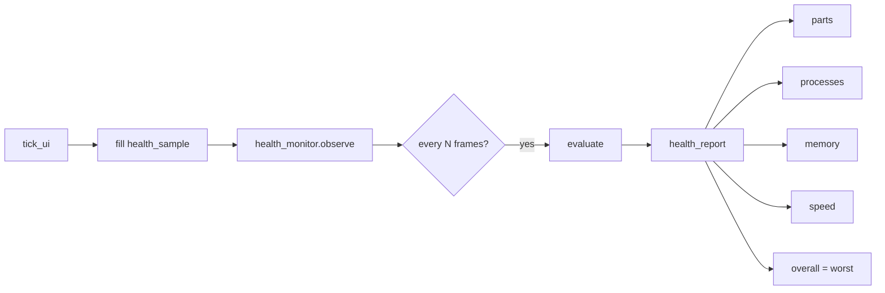

> **Status:** Current (v0.3) — see code for implementation truth

# Health Evaluation

Session health monitor for Lumen: subsystem readiness, process status, memory
pressure, and frame-speed budgets — aggregated into a single `health_report`.

**Related:** [architecture.md](../architecture.md) · [memory-management.md](memory-management.md) ·
[rendering-performance.md](rendering-performance.md) · [errors-and-logging.md](errors-and-logging.md)

---

## 1. Design goals

| Goal | Mechanism |
|------|-----------|
| Know which parts are live vs stub | `subsystem_health` + `implemented` flag |
| Track multi-process session | `process_health` for compositor / shell / worker |
| Memory visibility | Arenas, import cache, GPU budget, pressure level |
| Speed / latency | FPS, tick budgets, drop ratio, frame latency |
| Non-hot-path | Sample every frame; evaluate every N frames (default 30) |
| No upward deps | Compositor pushes POD `health_sample` into `lx.health` |

---

## 2. Module layout

```
lx.health
├── types     — health_level, subsystem_id, *\_health structs, health_report
├── sample    — health_sample, health_thresholds
└── monitor   — health_monitor, health_exporter
```

**Layer:** Runtime (depends on `lx.foundation`, `lx.runtime`, `lx.trace`).  
**Consumer:** `lx.compositor` feeds samples; shell/apps may later export their own.

---

## 3. Evaluation model



### Levels

| Level | Meaning |
|-------|---------|
| `ok` | Within thresholds / operational |
| `degraded` | Stub, soft budget miss, shell missing, moderate pressure |
| `critical` | Compositor down, hard budget miss, critical memory |
| `unknown` | Not yet sampled |

Overall = **worst** of parts, processes, memory, and speed.

---

## 4. What is measured

### Parts (`subsystem_id`)

| Part | Source sample fields | Stub behavior |
|------|----------------------|---------------|
| wayland | `wayland_bound` | degraded until bind |
| drm | `drm_open` | degraded until open |
| gfx | `gfx_ready` | degraded until device |
| scene | `scene_ok` | ok unless fault |
| input / session | `*_open` | degraded until open |
| shell_bridge | `shell_bridge_installed` | degraded until install |
| scheduler / memory / import_cache | always active scaffolds | ok |
| presentation | `presentation_hw` | degraded on timer-only |

### Processes

| Role | Signals |
|------|---------|
| compositor | `running`, optional RSS |
| shell | connected / not connected |
| worker | worker thread started |

### Memory

- UI / render arena used vs capacity
- Import cache occupancy
- GPU budget (when `VK_EXT_memory_budget` available)
- `memory_pressure` from `memory_budget_coordinator`

### Speed

- Measured vs target FPS
- `tick_ui` / `tick_render` vs hot-path budgets
- Frame latency vs `max_frame_latency_ms`
- Snapshot drop ratio (`dropped / (published + dropped)`)

---

## 5. Compositor wiring

```cpp
compositor::config cfg{
    .enable_health_monitor = true,
    .health = {
        .evaluate_every_n_frames = 30,
        .min_fps_ratio = 0.85,
        .memory_critical_pct = 90,
    },
};

// After tick_ui budgets:
comp.health().observe(sample);          // automatic via publish_health_sample
const auto& report = comp.health().last_report();
```

Access: `compositor::health()` → `health_monitor`.

Force a report: `health().evaluate()`.

---

## 6. Export (P1)

`health_exporter`:

| API | Status |
|-----|--------|
| `export_report` | `not_implemented` |
| `export_json_path` | `not_implemented` |

Future sinks: stderr summary, debug HUD, Unix socket for `lumen-ctl health`.

---

## 7. Hot-path rules

- Filling `health_sample` is O(1) POD copies — allowed on UI thread after tick.
- Full `evaluate()` runs on the configured interval, not every frame.
- Critical → `warn` once per evaluation; degraded → `debug` only.
- Never allocate or sync I/O inside `observe` / `evaluate` (exporter may later).

---

## 8. Implementation phases

| Phase | Deliverable | Scaffold |
|-------|-------------|----------|
| **H0** | Types + monitor + compositor sample | ✅ |
| **H1** | Real readiness flags after P0 bind/import | Runtime |
| **H2** | RSS / PID via `/proc` or platform API | Stub fields |
| **H3** | JSON / socket exporter + `lumen-ctl` | Stub |
| **H4** | Shell self-report over policy bridge | Future |

---

## 9. UML

| Diagram | Topic |
|---------|-------|
| [38-health-evaluation.mmd](../uml/38-health-evaluation.mmd) | Sample → evaluate → report |
