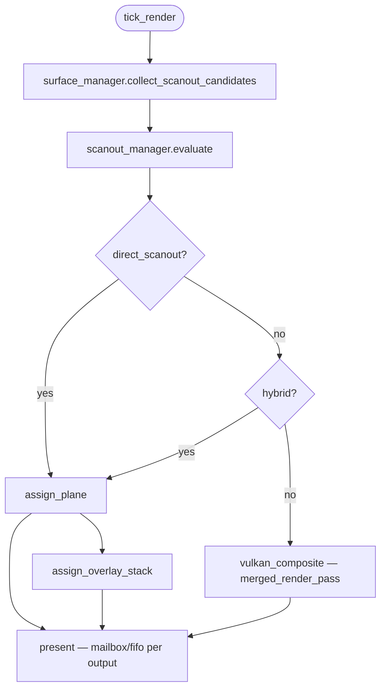

> **Status:** Current (v0.3) — see code for implementation truth

# Rendering Performance

High-efficiency compositor pipeline: zero-copy handoffs, direct scanout, present
timing, import caching, GPU resource pooling, and hot-path CPU budgets.

**Related:** [architecture.md](../architecture.md) · [threading.md](threading.md) ·
[dmabuf-vulkan-import.md](dmabuf-vulkan-import.md) · [errors-and-logging.md](errors-and-logging.md)

---

## 1. Design goals

| Goal | Mechanism |
|------|-----------|
| Zero-copy client pixels | dmabuf → Vulkan import |
| Zero-copy frame handoff | `snapshot_buffer` v2 — index swap, const ref acquire |
| Zero-copy draw build | `build_draw_list_into(write_draw_list())` — no interim copy |
| Low latency (discrete) | `present_mode::mailbox` + `backpressure_policy::triple_buffer` |
| Tear-free (integrated) | `present_mode::fifo_relaxed` + direct scanout |
| Minimal GPU state change | `batch_for_render()` + `pipeline_cache` + import cache |
| Bounded CPU work | `hot_path_budget` + `budget_tracker` |
| Accurate pacing | DRM page-flip + `presentation_tracker::bind_page_flip` |
| Partial KMS updates | `kms_damage_region` → `presentation_feedback.kms_damage` |
| Video/game priority | `content_hint` on `surface_commit` → scanout evaluation |
| Color-correct compositing | Linear-light workspace; encode once at output |

---

## 1.1 Color compositing space

All GPU compositing runs in **linear light** (`transfer_function::linear`). Surface
colors are decoded using each draw command's `src_space` and tagged `encoding`; the
output transfer function is applied **once** at the end of the render pass (before
KMS scanout or swapchain present). This prevents the sRGB-in-linear-space blending
errors common in legacy compositors.

---

## 2. Render path decision tree

Evaluated **every frame** on the render thread (after snapshot acquire):



### Direct scanout eligibility (all required)

- Single fullscreen opaque surface on output
- Format/modifier supported by primary plane
- No overlapping translucent windows above (hybrid uses overlay stack)
- `config.enable_direct_scanout == true`
- `content_hint::video` / `content_hint::game` preferred when multiple candidates
- `lx.drm::plane_manager::can_direct_scanout(output)`

**Module:** `lx.compositor.scanout` — `scanout_manager`, `scanout_plan`, `overlay_layer`

See [../uml/26-scanout-decision.mmd](../uml/26-scanout-decision.mmd), [../uml/31-hybrid-scanout-overlays.mmd](../uml/31-hybrid-scanout-overlays.mmd).

---

## 3. Snapshot buffer v2 + back-pressure

**Problem (v1):** `publish(draw_list)` copied up to 4096 `draw_command` structs per frame.

**Solution (v2):** UI writes into the **write slot** in place; `try_publish()` swaps atomic
read index only; render holds a **const reference** (no copy).

```
UI thread                          Render thread
─────────                          ─────────────
write_draw_list()  ──mutate──▶  slot[(read+1) % 3]
build_draw_list_into(slot)         (no interim copy)
batch_for_render()
try_publish(d, idx) ──swap──▶   read_idx
  drop / stall if full             acquire() → const&
                                   record Vulkan
                                   release(idx)
```

### Back-pressure policies

| Policy | Behavior |
|--------|----------|
| `drop_latest` | Skip publish when `in_flight >= max_in_flight` — lowest latency |
| `stall_ui` | `try_publish` returns `false` — UI waits for render slot |
| `triple_buffer` | 3 slots, default `max_in_flight = 2` — mailbox-friendly |

Configure via `compositor::config::snapshot`:

```cpp
compositor::config cfg{
    .snapshot = {
        .backpressure = scene::backpressure_policy::triple_buffer,
        .max_in_flight = 2,
    },
};
```

| API | Thread | Cost |
|-----|--------|------|
| `write_draw_list()` | UI | O(1) slot access |
| `try_publish()` | UI | O(1) atomic index swap |
| `acquire()` | Render | O(1) const ref |
| `release()` | Render | O(1) in-flight counter |

**Module:** `lx.scene.snapshot` — `snapshot_buffer`, `backpressure_policy`, `snapshot_config`

See [../uml/27-snapshot-v2-handoff.mmd](../uml/27-snapshot-v2-handoff.mmd), [../uml/30-backpressure-policy.mmd](../uml/30-backpressure-policy.mmd).

### Draw list build (R1 — scaffold complete)

`scene_graph::commit_frame` calls `build_draw_list_into(write_draw_list())` directly.
No interim `draw_list` copy.

---

## 4. Per-output present mode

| Mode | GPU tier | Behavior |
|------|----------|----------|
| `mailbox` | Discrete | Latest frame, may drop — **lowest latency** |
| `fifo_relaxed` | Integrated | Adaptive vsync — **balanced** |
| `fifo` | Integrated | Strict vsync — **no tear** |
| `auto_select` | Any | discrete→mailbox, integrated→fifo_relaxed |

**Module:** `lx.compositor.output` — `output_manager`, `present_mode`, `output_state`

---

## 5. dmabuf import cache + LRU

**Cache key:** `(client_id, buffer_id, modifier)`

```
on_commit → import_cache.acquire(key, desc)
         → hit: reuse VkImage
         → miss: importer.import + store (evict LRU if at cap)
each frame → tick(frame_index): evict stale (use_count==0, age > threshold)
client disconnect → evict_client(client_id)
```

Configure via `compositor::config::import_cache`:

```cpp
gfx::import_cache_config{
    .max_entries = 512,
    .stale_frame_threshold = 120,
};
```

**Module:** `lx.gfx.import_cache` — `dmabuf_import_cache`, `import_cache_key`, `import_cache_config`

See [../uml/28-import-cache-sequence.mmd](../uml/28-import-cache-sequence.mmd).

---

## 6. Draw batching + pipeline cache

Before `try_publish()`, `draw_list::batch_for_render()` partitions opaque and
translucent draws, preserves paint order for alpha blending, and uses texture ID
only as a tiebreaker within a batch.

`pipeline_cache::acquire(pipeline_key)` returns cached pipeline handle (stub until P0 Vulkan).

`merged_render_pass` batches `textured_quad` draws in a single pass when scanout is not used.

**Module:** `lx.gfx.pipeline` — `pipeline_cache`, `merged_render_pass`, `textured_quad`

See [../uml/33-gpu-resource-pools.mmd](../uml/33-gpu-resource-pools.mmd).

---

## 7. DRM page-flip + presentation feedback

**Current (P0 stub):** timer-driven vsync on UI thread.

**Scaffold (R3):**

1. `lx.drm.atomic` — `kms_atomic_commit`, `kms_damage_region`, `page_flip_handler`
2. `presentation_tracker::bind_page_flip(kms_atomic)` — wires flip → feedback
3. `on_page_flip(page_flip_event)` — populates `kms_damage`, `frame_latency_ms`
4. `wp_presentation` — `on_feedback()` (P0 Wayland wire)

```cpp
presentation.bind_page_flip(compositor.kms_atomic());
// on flip: presentation.on_page_flip(event) → handler callback
```

See [../uml/29-present-feedback-sequence.mmd](../uml/29-present-feedback-sequence.mmd), [../uml/32-kms-atomic-damage.mmd](../uml/32-kms-atomic-damage.mmd).

---

## 8. Timeline semaphore pool

Avoid per-frame `VkSemaphore` create/destroy on explicit-sync paths.

**Module:** `lx.gfx.semaphore_pool` — `timeline_semaphore_pool`, `timeline_semaphore_handle`

Accessible via `gfx::device::semaphores()`.

---

## 9. Content-type hints

Clients (or compositor heuristics) set `content_hint` on `surface_commit`:

| Hint | Scanout priority |
|------|------------------|
| `game` | Highest |
| `video` | High |
| `normal` | Default |
| `subsurface_ui` | Lowest — prefer composite |

Used by `scanout_manager::evaluate` when multiple fullscreen candidates exist.

---

## 10. Hot-path CPU budgets

Default budgets (override via `compositor::config::hot_path`):

| Field | Default | Meaning |
|-------|---------|---------|
| `max_tick_ui_us` | 2000 µs | UI thread per-frame ceiling |
| `max_tick_render_us` | 4000 µs | Render thread per-frame ceiling |
| `max_draw_commands` | 4096 | Draw list capacity |
| `max_import_cache_entries` | 512 | Import cache size |
| `max_frame_latency_ms` | 32 ms | End-to-end latency target |

Compositor logs **`warn`** when a tick exceeds budget (never on every frame at `info`).

---

## 11. Module map

| Concern | Module |
|---------|--------|
| Snapshot v2 + back-pressure | `lx.scene.snapshot` |
| Direct scanout + hybrid overlays | `lx.compositor.scanout` |
| Content hints | `lx.compositor.surface` |
| Present mode | `lx.compositor.output` |
| Import cache LRU | `lx.gfx.import_cache` |
| Pipeline cache | `lx.gfx.pipeline` |
| Semaphore pool | `lx.gfx.semaphore_pool` |
| KMS atomic + damage | `lx.drm.atomic` |
| Present timing | `lx.scheduler.presentation` |
| CPU budgets | `lx.scheduler.budget` |

---

## 12. Implementation phases

| Phase | Deliverable | Scaffold |
|-------|-------------|----------|
| **R0** | v2 snapshot, scanout, import_cache, budget | ✅ |
| **R1** | Build into write slot; back-pressure policy | ✅ scaffold |
| **R2** | Direct scanout + hybrid overlay stack | ✅ API; `assign_*` → P0 |
| **R3** | DRM page-flip + presentation bridge | ✅ scaffold |
| **R4** | KMS damage blobs + LRU eviction | ✅ scaffold |
| **P0** | Real Wayland + dmabuf + Vulkan present | Runtime |

**Architecture is efficiency-ready.** Runtime proof waits on P0 implementation.

---

## 13. UML index

| Diagram | Topic |
|---------|-------|
| [26-scanout-decision.mmd](../uml/26-scanout-decision.mmd) | Scanout decision tree |
| [27-snapshot-v2-handoff.mmd](../uml/27-snapshot-v2-handoff.mmd) | Snapshot v2 sequence |
| [28-import-cache-sequence.mmd](../uml/28-import-cache-sequence.mmd) | Import cache hit/miss |
| [29-present-feedback-sequence.mmd](../uml/29-present-feedback-sequence.mmd) | Page-flip + presentation |
| [30-backpressure-policy.mmd](../uml/30-backpressure-policy.mmd) | Drop vs stall vs triple-buffer |
| [31-hybrid-scanout-overlays.mmd](../uml/31-hybrid-scanout-overlays.mmd) | Hybrid primary + overlay stack |
| [32-kms-atomic-damage.mmd](../uml/32-kms-atomic-damage.mmd) | Atomic commit + damage blob |
| [33-gpu-resource-pools.mmd](../uml/33-gpu-resource-pools.mmd) | Pipeline cache + semaphore pool |
